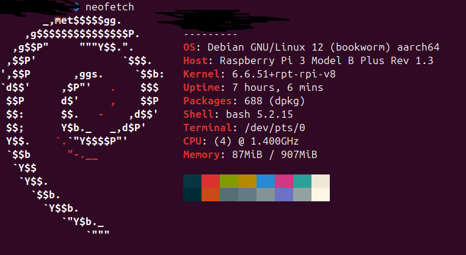

# Uptime Service Monitor

## What?
Is web-service monitoring tool that performs pings to registered web-apps in the application and stores ping logs overtime which can be useful for troubleshooting and gauging a web-app's reliability/up-time metrics.  
It sends notifications/alerts when one of the registered web-app is down.  
It features an embedded database (so no need to configure databases, just plug and play!) and a nifty spam notification filter to avoid Spamming your mails when a web-service has go down for period of time (can be configurable to your desired time).  
It's very useful for home-lab situations or when you want a way of monitor applications while developing or testing them

## Why ?


I have a humble home-lab where I host apps on the server running proxmox (running different apps on different operating system) for learning new concepts or exploring some ideas.  
I constantly ssh into the server to re-run/re-deploy apps that have crashed or updating them and when they do crash I mostly have no idea when they crash...  
this can be problematic if web-apps rely on each other (I don't implement SERIOUS fallback mechanisms since apps running in there aren't super critical its mostly for learning)...  
so it would be nice to know when a web-service goes down and or measure it reliability/uptime metrics overtime while interacting with the web-app and or simulating traffic and other interesting stuff like that.

plus I had the Raspberry Pi lying around and had no good use for it, and I didn't want to add serious observability/monitoring software that are enterprise grade that come with a ton of features that I'll never ever use.  

I thought I should make the repo PUBLIC, in case someone out there might need a similar app like this.(probability is low, but not ZERO)  
## How?
* 1. set up a gmail account for your app and enable less secure app access. (not ideal but easiest setup)  
* 2. add email details in the application.properties file in the app.  
* 3. download an ARM based JDK and transfer send it to your Raspberry Pi  
     [https://bell-sw.com/libericajdk-for-embedded/]() I used Liberica's JDK for this one.  
```linux
ladzi031@area51:~$ scp bellsoft-jdk21.0.7+9-linux-aarch64.deb p1@host.local:/home/p1
 ```
* 4. zip and transfer the app to the Raspberry Pi too  
```linux
ladzi031@area51:~/IdeaProjects$ scp uptimeMonitor.zip p1@host.local:/home/p1
```  
* 5. ssh into the Raspberry Pi and unzip both apps and run the below commands:
```linux
 :~ $ sudo dpkg -i bellsoft-jdk21.0.7+9-linux-aarch64.deb
 :~ $ sudo apt-get install libxi6 libxrender1 libxtst6
 :~ $ sudo apt --fix-broken install -y # u might want to do this.
 :~ $ java --version
openjdk 21.0.7 2025-04-15 LTS
OpenJDK Runtime Environment (build 21.0.7+9-LTS)
OpenJDK 64-Bit Server VM (build 21.0.7+9-LTS, mixed mode, sharing)
:~ $ cd uptimeMonitor
:~/uptimeMonitor $ ./mvnw clean package -DskipTests
:~/uptimeMonitor $ cd target && java -jar "NAME_OF_THE_APP_HERE".jar
```
## Raspberry Pi Specifications


## Are you RESTful?

---
| Endpoints                                           | Method | Description                                                                                                                                       | JSON request payload structure                                                                                                   |  
|-----------------------------------------------------|--------|---------------------------------------------------------------------------------------------------------------------------------------------------|----------------------------------------------------------------------------------------------------------------------------------|
| api/v1/service-monitoring/register                  | POST   | register your web-service URL 'Health-Check' endpoint                                                                                             | {"serviceName": "example_name","serviceHealthCheckEndpoint": "http://localhost:1234/healthcheck"}                                |
| api/v1/service-monitoring?siteId=12345-454dfd-345-434 | GET    | and endpoint to view all registered web-service urls with an optional siteId request parameter to get information specific to the siteId provided | N/A                                                                                                                              |
| api/v1/service-monitoring| PUT    | an endpoint to update web-service health-check endpoints                                                                                          | {"siteId": "87-da-46-90-9d4","serviceName": "example_name","serviceHealthCheckEndpoint": "http://localhost:1234/newHealthCheck"} |
|api/v1/service-monitoring/{siteId} | DELETE | endpoint to delete registered a web-service, this also all associated ping logs. the {siteId} is required                                         | N/A                                                                                                                              |
| api/v1/service-monitoring/ping-logs/{siteId}| GET    | get all ping logs associated with a web-service. {siteId} is required                                                                             | N/A                                                                                                                              |
| api/v1/service-monitoring/ping-logs/{siteId}| DELETE | delete all ping logs associated with a web-service, but web-service data is not deleted. {siteId} is required                                     | N/A                                                                                                                              |
| api/v1/service-monitoring/metric/{siteId}| GET | get web-service uptime percentage. the {siteId} is required                                                                                       | N/A                                                                                                                              |

## Tools used:
* Java
* H2 Database (with file based configuration)
* OpenFeign
* Java-Mail-Sender
